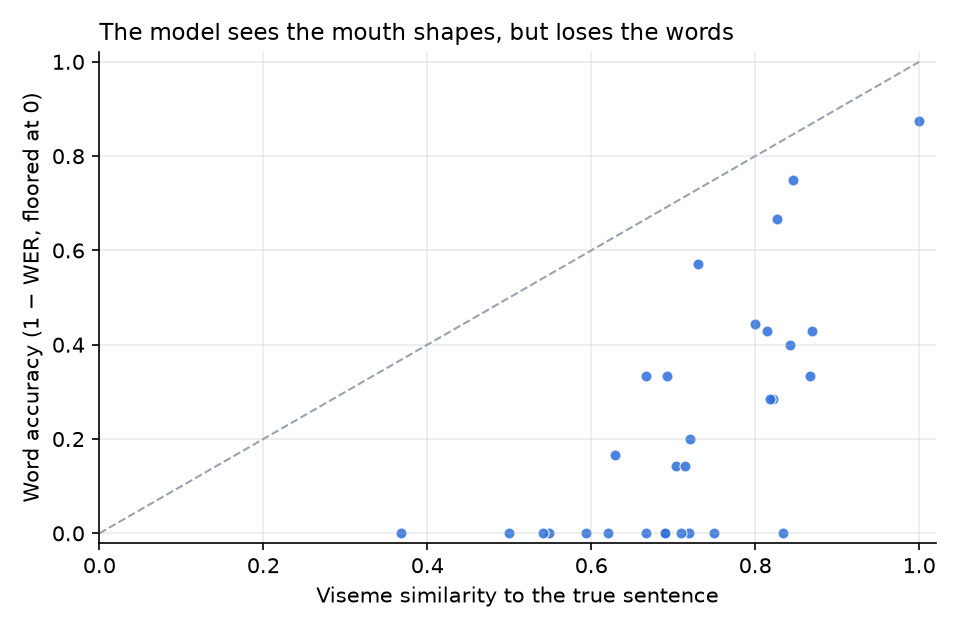

# Pilot 01 — open-vocabulary lip reading in Spanish

**Date:** 29 September 2026 · **Setup:** 30 everyday sentences, mouthed silently (no voice) by one speaker, recorded in the browser with a consumer camera · **Model:** Ma et al. (2022) CMU-MOSEAS Spanish visual-only model, run on a rented GPU (RunPod) · **LLM:** `openai/gpt-oss-120b` via Groq

**Question:** can an off-the-shelf model read *new* sentences (never recorded before) on a real user's lips, and how much does an LLM with conversational context help?

## Results

| Stage | WER | Understandable (WER ≤ 25 %) |
|---|---|---|
| Visual model alone | 86 % | 7 % |
| + LLM, no context | 86 % | 10 % |
| + LLM with context | 74 % | 7 % |
| Best of 3 options (with context) | 67 % | 13 % |

Go/no-go criterion: *best of 3* ≥ 60 % understandable. **Not met.**

For reference, the model's published WER on Spanish web videos is 44.5 %. Silent speech (no voice at all) from a consumer camera is a harder setting.

## Key finding: the visual information is there

WER punishes every wrong word, even when the model saw the right mouth shapes. Mapping both sentences to **visemes** (classes of sounds that look identical on the lips, see [`lipreading/visemes.py`](../../lipreading/visemes.py)) tells a different story:

| | Viseme match with the true sentence |
|---|---|
| Visual model reading | **72 %** |
| LLM correction (1st option, with context) | 60 % |

In **23 of 30** sentences, the raw reading fits the true mouth shapes better than the LLM's answer. The LLM often *answers the question* instead of decoding the lips (asked "Are you cold?", it replies "Yes, a little" when the speaker said "Pass me the blue blanket, please").



Most sentences sit far below the diagonal: the mouth shapes are largely right (0.6–0.9 similarity) but the words are wrong. The information is lost when going from mouth shapes to words, not in the vision.

## Next experiment

Keep the LLM, but constrain it with the visual evidence: ask for 8–10 candidates, re-rank them by viseme similarity to the reading, and tighten the prompt so it decodes rather than replies. This runs offline on the saved readings (no GPU):

```bash
python -m lipreading.vsr.evaluate --zip package.zip --readings readings.json --rerank 10
```

## Reproduce the analysis

```bash
python experiments/pilot-01/analyze.py
```

`results.json` holds the context, true sentence, model reading and the LLM's first option for each clip. The LLM-no-context and best-of-3 rows come from the original run's report. No video or landmarks are published.
